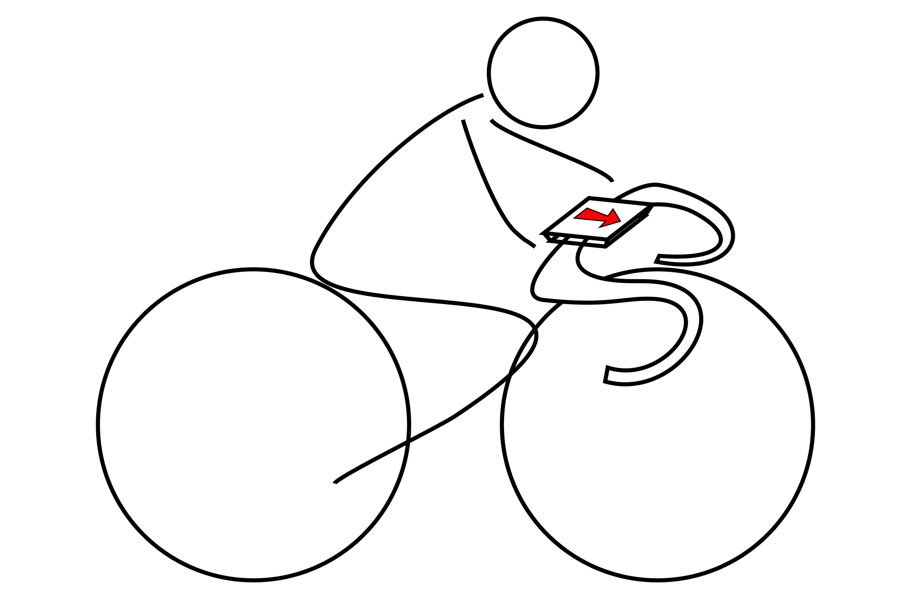

<p align="center">
  
</p>

<h1 align="center">
AST-Monitor --- A wearable Raspberry Pi computer for cyclists
</h1>

<p align="center">
  
  
  
  
  
  
  
  
</p>

<p align="center">
  
  
  
  
</p>

<p align="center">
  
    
</p>

<p align="center">
  <a href="#-graphical-user-interface">💻 Graphical User Interface</a> •
  <a href="#️-hardware">⚙️ Hardware</a> •
  <a href="#️-software">🖥️ Software</a> •
  <a href="#-installation">📦 Installation</a> •
  <a href="#-deployment">📢 Deployment</a> •
  <a href="#-examples">🚀 Examples</a> •
  <a href="#-license">🔑 License</a> •
  <a href="#-cite-us">📄 Cite us</a> •
  <a href="#-further-read">📖 Further read</a> •
  <a href="#-related-packagesframeworks">🔗 Related packages</a> •
  <a href="#-references">📝 References</a> •
  <a href="#-contributors">🫂 Contributors</a>
</p>

Welcome to AST-Monitor: Revolutionizing Sport Training Sessions! 🏋️‍♂️ This repository aims to introduce a low-cost, and efficient embedded device that can transform the way you monitor
cycling training sessions. Allow us to present AST-Monitor.

To begin, we invite you to explore the paper that introduces the capabilities of AST-Monitor. Dive into the future of artificial sports trainers by reading this [paper](https://arxiv.org/abs/2109.13334). 📄💡

* **Free software:** MIT license
* **Python versions:** 3.8.x, 3.9.x, 3.10.x, 3.11.x, 3.12.x
* **Documentation:** [https://ast-monitor.readthedocs.io/en/latest](https://ast-monitor.readthedocs.io/en/latest)
* **Tested OS:** Windows, Ubuntu, Fedora, Alpine, Arch, macOS. **However, that does not mean it does not work on others**

## 💻 Graphical User Interface

### Basic data: Power at Your Fingertips 💪

<p align="center">
  
</p>
The initial page of the AST-Monitor application presents essential parameters, providing real-time insights into an athlete's performance. Gain access to information such as the athlete's current speed and heart rate. After a training session, you'll also receive a comprehensive overview, including total distance covered, session duration, and total ascent conquered. 📱🚴‍♂️

### Interactive map: Embark on a Visual Journey 🗺️🚀

<p align="center">
  
</p>
As you navigate uncharted territories, this map reveals your precise location in real-time. And allows you to track your progress on the route in real time. 🌍🚴‍♂️🗺️

### Interval training data: Unleash Your Inner Athlete 🏃‍♀️💪

<p align="center">
  
</p>
  Discover the duration of each phase, track your current heart rate, and marvel at the average heart rate achieved. But that's not all—brace yourself for the Digital Twin proposed heart rate and witness the thrilling difference between your current heart rate and the proposed target. Prepare to dominate your workouts with the AST-Monitor! 🏋️‍♀️

### Interval training plan: Unleash the Potential 💯📝💥

<p align="center">
  
</p>
 Load up and embark on thrilling interval trainings that await you in the "AST-Monitor/development/trainings" folder. These trainings, meticulously crafted in the domain-specific language <a href="https://github.com/firefly-cpp/ast-tdl">AST-TDL</a>, are designed to take you to the next level. Once successfully loaded, witness the training plan come to life before your eyes. 🚀📋💥

## ⚙️ Hardware
### Where Innovation Meets Performance ⚙️🔩💡

Prepare to be dazzled by the complete hardware setup featured in AST-Monitor.

<p align="center">
  
</p>

Let's take a closer look at the components:

* **A platform with fixing straps** that securely attach to your bicycle, ensuring a seamless training experience. 🚲🔒
* **The powerful Raspberry Pi 4 Model B micro-controller**, powered by the dynamic Raspbian OS. 💻
* **A five-inch LCD touchscreen display**, allowing the interaction with AST-Monitor during the training. ✨🖥️
* **Equipped with a USB ANT+ stick**, AST-Monitor captures the heartbeat of your training, providing crucial data for your journey to greatness. 📡
* **Adafruit's Ultimate GPS HAT module** joins the lineup, empowering you with location information and paving the way for GPS integration (coming soon!). 🌐🛰️

But that's not all:

A Serial Peripheral Interface (SPI) protocol ensures seamless communication between the Raspberry Pi and the GPS
peripheral, guaranteeing accurate and timely data. The screen display, connected using a physically shortened HDMI
cable, ensures a sleek and compact design that doesn't compromise performance.

During the testing phase, the AST-Monitor prototype was powered by Trust's 5 VDC power bank, providing unparalleled
endurance. While the current prototype may be a bit bulky, rest assured, our team is hard at work, exploring sleeker and
more discreet solutions. 💪💦

For those who crave a glimpse inside AST-Monitor:

<p align="center">
  
</p>

Welcome to the next stage of sports training. Welcome to AST-Monitor—your ultimate companion on the road to victory!
🌟🏆🚀

## 🖥️ Software

### Dependencies 📦🔗

List of dependencies:

| Package                   | Version | Platform |
|---------------------------|:-------:|:--------:|
| PyQt6                     | ^5.15.6 |   All    |
| matplotlib                | ^3.5.1  |   All    |
| geopy                     | ^2.2.0  |   All    |
| openant                   | ^1.2.0  |   All    |
| pyqt-feedback-flow        | ^0.1.0  |   All    |
| tcxreader                 | ^0.4.1  |   All    |
| sport-activities-features | ^0.3.6  |   All    |

Additional note: adafruit-circuitpython-gps package must be installed in order to work with the GPS sensor:

```sh
$ pip install adafruit-circuitpython-gps
```

## 📦 Installation

Install AST-Monitor with pip:

```sh
$ pip install ast-monitor
```

In case you want to install directly from the source code, use:

```sh
$ git clone https://github.com/firefly-cpp/AST-Monitor.git
$ cd AST-Monitor
$ poetry build
$ python setup.py install
```

To install AST-Monitor on Fedora Linux, please use:

```sh
$ dnf install python3-ast-monitor
```

To install AST-Monitor on Alpine Linux, please use:

```sh
$ apk add py3-ast-monitor
```

To install AST-Monitor on Arch Linux, please use an [AUR helper](https://wiki.archlinux.org/title/AUR_helpers):

```sh
$ yay -Syyu python-ast-monitor
```

## 📢 Deployment

Our project was deployed on a Raspberry Pi device using Raspberry Pi OS.

The hardware configuration of AST-Monitor using Raspberry Pi OS is described
in <a href="https://github.com/firefly-cpp/AST-Monitor/blob/main/HARDWARE_CONFIGURATION.md">
HARDWARE_CONFIGURATION.md</a>.

## 🚀 Examples

### Basic run

```python
import os
import sys

from PyQt6 import QtWidgets

try:
    from ast_monitor.model import AST
except ModuleNotFoundError:
    sys.path.append('../')
    from ast_monitor.model import AST

# Paths to the files with heart rates and GPS data.
hr_data = os.path.join(os.path.dirname(os.path.abspath(__file__)), '..', 'sensor_data', 'hr.txt')
gps_data = os.path.join(os.path.dirname(os.path.abspath(__file__)), '..', 'sensor_data', 'gps.txt')
route_data = os.path.join(os.path.dirname(os.path.abspath(__file__)), '..', 'development', 'routes', 'route.json')

if __name__ == '__main__':
    app = QtWidgets.QApplication(sys.argv)
    window = AST(hr_data, gps_data, route_data)
    window.show()
    sys.exit(app.exec())
```

## 🔑 License

This package is distributed under the MIT License. This license can be found online
at <http://www.opensource.org/licenses/MIT>.

## Disclaimer

This framework is provided as-is, and there are no guarantees that it fits your purposes or that it is bug-free. Use it
at your own risk!

## 📄 Cite us

Lukač, L., Fister Jr., I., Fister,
I. "[Digital Twin in Sport: From an Idea to Realization](https://www.mdpi.com/2076-3417/12/24/12741)." Applied Sciences
12.24 (2022): 12741, DOI: [10.3390/app122412741](http://dx.doi.org/10.3390/app122412741).

## 📖 Further read
[1] [Awesome Computational Intelligence in Sports](https://github.com/firefly-cpp/awesome-computational-intelligence-in-sports)

## 🔗 Related packages/frameworks

[1] [sport-activities-features: A minimalistic toolbox for extracting features from sports activity files written in Python](https://github.com/firefly-cpp/sport-activities-features)

[2] [ast-tdl: Training Description Language for Artificial Sport Trainer](https://github.com/firefly-cpp/ast-tdl)

## 📝 References

Fister Jr, I., Fister, I., Iglesias, A., Galvez, A., Deb, S., & Fister, D. (2021). On deploying the Artificial Sport
Trainer into practice. arXiv preprint [arXiv:2109.13334](https://arxiv.org/abs/2109.13334).

Fister Jr, I., Salcedo-Sanz, S., Iglesias, A., Fister, D., Gálvez, A., & Fister, I. (2021). New Perspectives in the
Development of the Artificial Sport Trainer. Applied Sciences, 11(23), 11452.
DOI: [10.3390/app112311452](https://doi.org/10.3390/app112311452)

## 🫂 Contributors

<!-- ALL-CONTRIBUTORS-LIST:START - Do not remove or modify this section -->
<!-- prettier-ignore-start -->
<!-- markdownlint-disable -->
<table>
  <tbody>
    <tr>
      <td align="center" valign="top" width="14.28%"><a href="http://www.iztok-jr-fister.eu/"><br /><sub><b>Iztok Fister Jr.</b></sub></a><br /><a href="https://github.com/firefly-cpp/AST-Monitor/issues?q=author%3Afirefly-cpp" title="Bug reports">🐛</a> <a href="https://github.com/firefly-cpp/AST-Monitor/commits?author=firefly-cpp" title="Documentation">📖</a> <a href="https://github.com/firefly-cpp/AST-Monitor/commits?author=firefly-cpp" title="Code">💻</a> <a href="#maintenance-firefly-cpp" title="Maintenance">🚧</a> <a href="#mentoring-firefly-cpp" title="Mentoring">🧑‍🏫</a> <a href="#platform-firefly-cpp" title="Packaging/porting to new platform">📦</a></td>
      <td align="center" valign="top" width="14.28%"><a href="https://github.com/luckyLukac"><br /><sub><b>luckyLukac</b></sub></a><br /><a href="https://github.com/firefly-cpp/AST-Monitor/issues?q=author%3AluckyLukac" title="Bug reports">🐛</a> <a href="https://github.com/firefly-cpp/AST-Monitor/commits?author=luckyLukac" title="Documentation">📖</a> <a href="https://github.com/firefly-cpp/AST-Monitor/commits?author=luckyLukac" title="Code">💻</a> <a href="#design-luckyLukac" title="Design">🎨</a></td>
      <td align="center" valign="top" width="14.28%"><a href="http://carlosal1015.github.io"><br /><sub><b>Oromion</b></sub></a><br /><a href="#platform-carlosal1015" title="Packaging/porting to new platform">📦</a></td>
      <td align="center" valign="top" width="14.28%"><a href="https://github.com/alenrajsp"><br /><sub><b>alenrajsp</b></sub></a><br /><a href="#content-alenrajsp" title="Content">🖋</a> <a href="https://github.com/firefly-cpp/AST-Monitor/commits?author=alenrajsp" title="Code">💻</a> <a href="#maintenance-alenrajsp" title="Maintenance">🚧</a> <a href="https://github.com/firefly-cpp/AST-Monitor/issues?q=author%3Aalenrajsp" title="Bug reports">🐛</a></td>
      <td align="center" valign="top" width="14.28%"><a href="https://github.com/KukovecRok"><br /><sub><b>Tatookie</b></sub></a><br /><a href="https://github.com/firefly-cpp/AST-Monitor/commits?author=KukovecRok" title="Documentation">📖</a> <a href="https://github.com/firefly-cpp/AST-Monitor/issues?q=author%3AKukovecRok" title="Bug reports">🐛</a></td>
      <td align="center" valign="top" width="14.28%"><a href="https://github.com/rhododendrom"><br /><sub><b>rhododendrom</b></sub></a><br /><a href="#design-rhododendrom" title="Design">🎨</a></td>
      <td align="center" valign="top" width="14.28%"><a href="https://github.com/sertonix"><br /><sub><b>Sertonix</b></sub></a><br /><a href="https://github.com/firefly-cpp/AST-Monitor/issues?q=author%3Asertonix" title="Bug reports">🐛</a></td>
    </tr>
    <tr>
      <td align="center" valign="top" width="14.28%"><a href="https://github.com/lahovniktadej"><br /><sub><b>Tadej Lahovnik</b></sub></a><br /><a href="https://github.com/firefly-cpp/AST-Monitor/commits?author=lahovniktadej" title="Documentation">📖</a> <a href="https://github.com/firefly-cpp/AST-Monitor/commits?author=lahovniktadej" title="Code">💻</a> <a href="https://github.com/firefly-cpp/AST-Monitor/issues?q=author%3Alahovniktadej" title="Bug reports">🐛</a></td>
    </tr>
  </tbody>
</table>

<!-- markdownlint-restore -->
<!-- prettier-ignore-end -->

<!-- ALL-CONTRIBUTORS-LIST:END -->
<!-- prettier-ignore-start -->
<!-- markdownlint-disable -->

<!-- markdownlint-restore -->
<!-- prettier-ignore-end -->

<!-- ALL-CONTRIBUTORS-LIST:END -->
